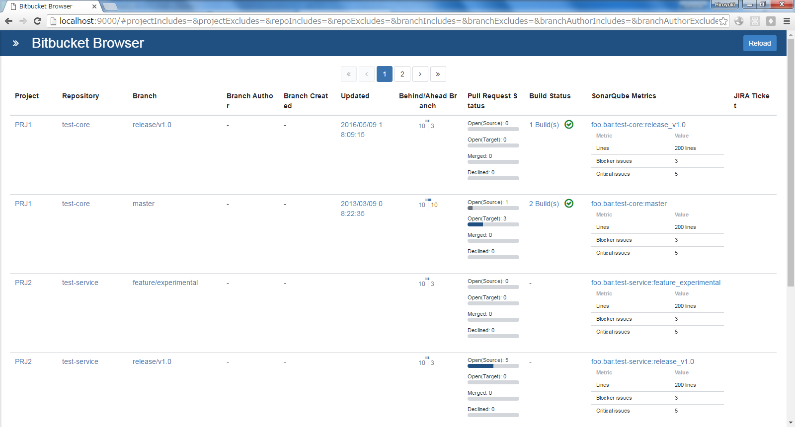

# Bitbucket Browser

- [About](#about)
- [Settings](#settings)
- [Development](#development)
 - [Requirements](#requirements)
 - [Setup](#setup)
 - [Run with development mode](#run-with-development-mode)
 - [Release Build](#release-build)
- [License](#license)

## About

**Bitbucket Browser** is a Viewer for [Atlassian Bitbucket (formerly Stash)](https://bitbucket.org/).



## Deploy
**Bitbucket Browser** is made by static files only and **it's not Bitbucket plugins**. You can deploy the files to the reverse proxy web server which is in front of your Bitbucket server.

### Notes
You must setup the web server to proxy Bitbucket server and configure cookie path converting correctly in order to use the Bitbucket server cookie.

For example, if your web server proxy Bitbucket server to `/bitbucket` and you deploy **Bitbucket Browser** under `/bitbucket-browser`, you should configure to convert the cookie path from `/bitbucket` to `/`.

## Settings

1. Rename `settings.json.sample` file to `settings.json`.
2. Edit `settings.json`. You can customize the column's displayName and enabled options.

```
{
    "title": "Bitbucket Browser",
    "baseUrl": "/bitbucket",
    "debug": false,
    "items": {
        "project": {
            "displayName": "Project"
        },
        "repo": {
            "displayName": "Repository"
        },
        "branch": {
            "displayName": "Branch"
        },
        "branchAuthor": {
            "enabled": false,
            "displayName": "Branch Author"
        },
        "branchCreated": {
            "enabled": true,
            "displayName": "Branch Created"
        },
        "latestCommitDate": {
            "enabled": true,
            "displayName": "Updated"
        },
        "behindAheadBranch": {
            "enabled": true,
            "displayName": "Behind/Ahead Branch"
        },
        "pullRequestStatus": {
            "enabled": true,
            "displayName": "Pull Request Status"
        },
        "buildStatus": {
            "enabled": true,
            "displayName": "Build Status"
        },
        "sonarForBitbucketStatus": {
            "enabled": false,
            "displayName": "Sonar for Stash Metric",
            "resolver": {
                "fields": [
                    {
                        "key": "duplicatedLines",
                        "displayName": "Dupl. lines",
                        "enabled": true
                    },
                    {
                        "key": "coverage",
                        "displayName": "Coverage",
                        "enabled": true
                    },
                    {
                        "key": "violations",
                        "displayName": "Issues",
                        "enabled": false
                    },
                    {
                        "key": "technicalDebt",
                        "displayName": "Tech. dept",
                        "enabled": true
                    }
                ]
            }
        },
        "sonarQubeMetrics": {
            "enabled": false,
            "displayName": "SonarQube Metrics",
            "resolver": {
                "baseUrl": "/sonar",
                "projectBaseKey": "foo.bar",
                "__comment__": "see http://docs.sonarqube.org/display/SONARQUBE43/Metric+definitions",
                "fields": [
                    {
                        "key": "lines",
                        "displayName": "Lines",
                        "enabled": true
                    },
                    {
                        "key": "duplicated_lines",
                        "displayName": "Dupl. lines",
                        "enabled": false
                    },
                    {
                        "key": "blocker_violations",
                        "displayName": "Blocker issues",
                        "enabled": true
                    },
                    {
                        "key": "critical_violations",
                        "displayName": "Critical issues",
                        "enabled": true
                    },
                    {
                        "key": "mejor_violations",
                        "displayName": "Major issues",
                        "enabled": false
                    },
                    {
                        "key": "minor_violations",
                        "displayName": "Minor issues",
                        "enabled": false
                    },
                    {
                        "key": "info_violations",
                        "displayName": "Info issues",
                        "enabled": false
                    },
                    {
                        "key": "sqale_index",
                        "displayName": "Tech. dept",
                        "enabled": false
                    }
                ]
            }
        },
        "branchNameLink": {
            "enabled": true,
            "displayName": "JIRA Ticket",
            "resolver": {
                "pattern": "ISSUE\\-[0-9]+",
                "baseUrl": "http://jira.example.org/browse",
                "displayName": "JIRA Ticket"
            }
        },
        "jiraIssue": {
            "enabled": true,
            "displayName": "JIRA Ticket",
            "resolver": {
                "pattern": "ISSUE\\-[0-9]+",
                "baseUrl": "/jira",
                "linkBaseUrl": "http://jira.example.org/jira/browse",
                "fields": [
                    {
                        "key": "status.name",
                        "displayName": "Status",
                        "enabled": true
                    },
                    {
                        "key": "created",
                        "displayName": "Created",
                        "datePattern": "YYYY/MM/DD",
                        "enabled": true
                    }
                ]
            }
        }
    }
}
```

## Development

### Requirements 

* [Node.js](https://nodejs.org/)

### Setup

1. Install JavaScript dependencies.

 ```bash
npm install
 ```

### Run with development mode

1. Run dummy bitbucket server for development.

 ```bash
npm run server
 ```

2. Run webpack dev server.

 ```bash
npm start
 ```
 
3. Open http://localhost:9000

### Release Build

Run webpack with production mode. All you have to do is run `npm run build`. The artifacts are created under `./public` directory.

```bash
npm run build
```

## License

Licensed under the [MIT](/LICENSE.txt) license.
